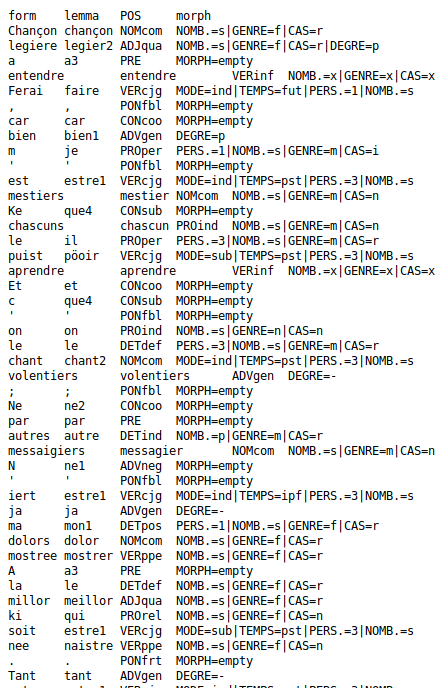

Deucalion Model Ancien Français ENC
===================================

[](https://cloud.docker.com/repository/docker/ponteineptique/deucalion-model-af)

# Credits

This software is based on Pie by Enrique Manjavacas (@emanjavacas) and Mike Kestemont (@mikekestemont) [](https://zenodo.org/badge/latestdoi/131014015)

The web application and its maintenance is done by Thibault Clérice ( @ponteineptique ). To learn how to cite this repository, go check [our releases](https://github.com/chartes/deucalion-model-af/releases).

# Information about the model

The model was trained on the following corpora :

- _Geste: un corpus de chansons de geste_, dir. Jean-Baptiste Camps, avec la collab. d'Elena Albarran, Alice Cochet & Lucence Ing, Paris, 2016-…, http://github.com/Jean-Baptiste-Camps/Geste.
- _Édition nativement numérique du recueil hagiographique "Li Seint Confessor" de Wauchier de Denain d'après le manuscrit 412 de la Bibliothèque nationale de France_, éd. Ariane Pinche, Lyon, en cours (only _Dialogues_ and La vie de Saint Martin are used right now. Data are closed source until publication of the PhD thesis)
- _Les Institutes de Justinien en français_, éd. F. Olivier-Martin (1935), éd. revue par F. Duval, lemmatisée par F. Duval et L. Ing. Paris, 2018.
- _Chrétien de Troyes: Cligès, Erec, Lancelot, Perceval, Yvain -- Manuscrit P (BnF Fr. 794)_, éd. P. Kunstmann (2009), annotation revue par J.B. Camps et L. Ing (2017).

The **annotations** are made according to the following reference lists:

- **lemma:** Adolf Tobler et Erhard Friedrich Lommatzsch, _Altfranzösisches Wörterbuch: édition électronique_, éd. Peter Blumenthal et Achim Stein, Stuttgart, F. Steiner, 2002.
- **POS and morph:** Sophie Prévost, Céline Guillot, Alexei Lavrentiev et Serge Heiden, _Jeu d’étiquettes morphosyntaxiques  CATTEX2009-max_, Lyon, 2013, http://bfm.ens-lyon.fr/IMG/pdf/Cattex2009_2.0.pdf.

More information on the annotation practice can be found in the wiki of the _Geste_ corpus: [https://github.com/Jean-Baptiste-Camps/Geste/wiki](https://github.com/Jean-Baptiste-Camps/Geste/wiki).

Sample from annotation:

```tsv
form	lemma	POS	morph
G'	je	PROper	PERS.=1|NOMB.=s|GENRE=m|CAS=n
irai	aler	VERcjg	MODE=ind|TEMPS=fut|PERS.=1|NOMB.=s
sor	sor2	PRE	MORPH=empty
eus	il	PROper	PERS.=3|NOMB.=p|GENRE=m|CAS=i
por	por2	PRE	MORPH=empty
lor	lor2	DETpos	PERS.=3|NOMB.=p|GENRE=f|CAS=r
terres	terre	NOMcom	NOMB.=p|GENRE=f|CAS=r
saisir	saisir	VERinf	MORPH=empty
```

# Error you can expect

If you want to have an idea about the errors the model can do, please have a look at [this file for lemma and POS](Confusion.lemma.pos.md) and [this file for morph](Confusion.morph.md)

## Example

This was run on a text that was not seen during training : 



# Install

To run, you'll need to install Docker. Then, you can simply run the following commands :

```shell
docker build -t deucalion-af:latest .
docker run -p 5001:5000 deucalion-af:latest
```

You can replace 5001 with any port you want to run the service on.

Then, simply go to  http://127.0.0.1:5001 or directly to http://127.0.0.1:5001/api?data=SOIGNORS,or%20escoutez,que%20D%C3%A9s%20vos%20soit%20amis,.III%20.vers%20de%20bone%20estoire,se%20je%20les%20vos%20devis or post any data to the same URI with `data` parameters containing your plain text.
